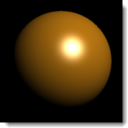
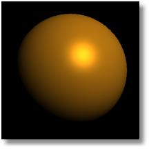
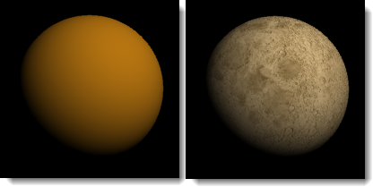
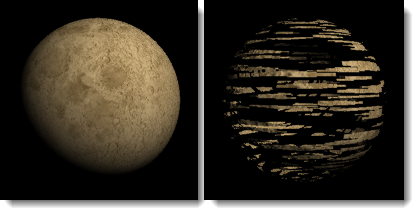
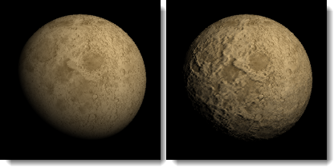
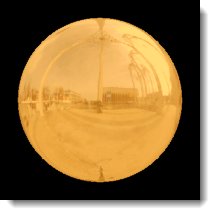
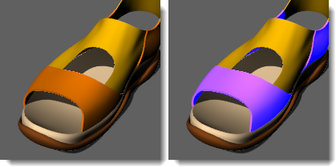
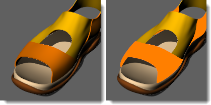

---
---

# Material Editor
<!-- TODO: THis needs to get the images from the previous source-->
<!-- TODO: This content is fromthe old source.  It needs heavy editing-->
MaterialEditor
&#160;

###  [Where can I find this command?](#) 
Toolbars
Menus
 [Panels](panels-menu.html) 
 [id="a4" style="position: relative;">Render]() 
Material Editor
Shortcut
MaterialEditor command
Specifies the color, finish, transparency, texture, and bump for use by the built-in Rhino renderer.
Materials can be dragged and dropped onto [Material](materialeditor.html), [Texture](texturepalette.html), and [Environment](environmenteditor.html) controls.
Any number of materials can be stored in the model. Materials can be designed in-place in the material and environment editors by adding textures as child. Opening a floating preview allows visualization of the texture during its development.
Colors and textures can be dragged from the color swatch and dropped onto any other color swatch or control in the Material Editor, [Texture Palette](texturepalette.html), or [Environment Editor](environmenteditor.html).
Materials Panel

###  * [id="a9" style="position: relative;">]() *  [id="a6" style="position: relative;">Options]() 

### Back
Walks back though the previously selected materials.

### Forward
Walks forward through the previously selected materials.

### Currently selected material name
Displays the current material name.

### Menu
Displays the [Tools menu.](materialeditor.html#tools-menu) 

### Help
Previews
Displays the preview thumbnail.

##### To display context menus

>Right-click a thumbnail to display the [id="a5" style="position: relative;">material context menu]().
>Right-click the blank area to display the [id="a28" style="position: relative;">new material context menu]().

###  [Add new](materialeditor.html#create-new) 
Opens the Render Content [library](libraries.html) of materials.
The materials in the library act as templates for creating materials in the model.

### Window blind control
Closes the editor.
Name
Names the material.
 **Note** : When a texture or image file is dragged to a Rhino object, a material with that image is assigned to the object.
Basic Settings
All materials have basic settings. The default material is white and matte, with no reflectivity or transparency.

## Color
Sets the material's base (also called *diffuse* ) color.
The color used to [render](render.html) surfaces, polysurfaces, or polygon meshes.
The color option does not affect the select wireframe display. To change the color of the wireframe display, change the color of the object's [layer](layer.html) or set the color in [Object Properties](properties.html) 

##### To change the color

>Click the color swatch to select a color from the [Select Color](select-color.html) dialog box.

>Click the menu arrow or [id="a2" style="position: relative;">right-click]() the swatch to open the context menu.

### Menu options

#### Color Picker
Opens the [Select Color](select-color.html) dialog box.

#### Eye Dropper
Allows picking the color from anywhere on the screen.

#### Copy
Copies the color in the color swatch.

#### Paste
Pastes the color from one color swatch to another.

>In the edit box, specify the percentage of strength the color.

## Gloss finish
Adjusts the highlight from matte to glossy.

##### To change the glossiness

>Move the slider to the right to increase the glossiness.

## To set the gloss color

>Select the gloss color using the color swatch.

 **Note:** Set the highlight color to match the base color for metallic materials. Set the gloss color to white for plastic materials.

## Reflectivity
Sets the material's reflectivity.

>Move the slider to the right to increase the reflectivity.
>Select the reflective color using the color swatch.

## Transparency
Adjusts the transparency of an object in the [rendered](render.html) image.

>Move the slider to the right to increase the transparency.
>Select the transparent color using the color swatch.

#### IOR (Index of Refraction)
Sets the level of transparency based on the index of refraction (IOR) scale.
Example IOR values are shown in the following table:

### Material

### IOR
Vacuum
1. Air
1. Ice
1. Water
1. Glass
1. Emerald
1. Ruby/Sapphire
1. Diamond
1. Textures
Textures (bitmap images or procedural textures) can be used for color, transparency, bump, and environment.
 **Note** : Images changed outside of Rhino in Photoshop or a similar program automatically update in the rendered view.
The following bitmap formats are supported:

>Windows Bitmap (.bmp)
>JPEG - JFIF Compliant (.jpg, .jpeg, .jpe)
>Portable Network Graphics (.png)
>Tagged Image File Format (.tif, .tiff)
>Truevision Targa (.tga)
>DDS files (.dds)
>HDRi files (.hdr, .hdri)
>OpenEXR files (.exr)

##### To specify an image

>Click in the **(empty - click to assign)** control.

The checkbox automatically becomes checked the first time you do this. You can clear the checkbox to turn off the assignment.

>Select an image file to use.
>In the edit box, specify the percentage of strength the image will use to affect the color, transparency, bump, or environment.

## Color
Specifies a texture to use as the material's color.

## Transparency
Sets a texture to use as the material's transparency.

## Bump
Sets a texture to use as the material's bump.
Defines the name of a bitmap file that will be mapped on the surface as a bumpmap when you render the scene.
A bitmap image makes a surface appear bumpy in a rendered image but does not modify the shape of the surface.

## Environment
Sets a texture to use as the material's environment. This will be mapped onto the surface as though it were being reflected.
 **Note** : The bitmap should be an *angular map* or *light probe* projection (spherical) image.&#160;Other image projections will produce the reflection effect, but it will be distorted and not produce the realistic environment reflection.

Advanced Settings

### Emission color
Adds a color to the shaded result. It does not take into account the lighting, so if the emission color is white, the object will always appear white. If the emission color is grey, all parts of the object will appear brighter than they would otherwise.
 *Orange material emission color black (left); emission color blue (right).* 

### Ambient color
Adds a color to the unlit part of the object. This is used rarely to brighten up shadowed areas. The results are not normally useful.

### Enable diffuse lighting
If this setting is off, the object will render the diffuse color all over with no shadowing or shading. It is used for picture frames to ensure that the color of the texture remains constant over the surface.
 *Orange material diffuse lighting on (left); diffuse lighting off (right).* 
Notes
Add notes to provide extra information. The notes are saved with the model and appear as tooltips in the Library, Material, Environment, and Texture panels when you mouse-over the thumbnails.
Blend Material Settings
The Blend material takes two materials and blends between them by the amount specified.

### Material 1 / Material 2
The two materials to mix.

### Mix amount
The value represents the percentage of Material 1.

Composite Material Settings
The Composite material is a more complex blending material capable of merging up to ten materials with different blending modes (Add, Subtract, Multiply). Each material can have a different mode and amount specified.


## Tools menu
These settings also appear on right-click context menus for the thumbnail previews and the thumbnail background.

### Assign to Selection
Assigns the current material to selected objects.

#### To assign a material to objects

>Click **Assign to Selection**.
>In the Rhino viewport, select the target objects.

#### To pre-select objects

>In the Rhino viewport, select the target objects.
>Click **Assign to Selection**.

 **Note** : The target objects can be selected either before or after clicking Assign to Selection.

#### To drag and drop materials to objects

>Drag the material from the thumbnails or list onto the target objects.

 **Note** : Drag and drop works for only one object at a time.

### Assign to Layers
Assigns the current material to layers.

#### To assign a material to layers

>Click **Assign to Layers**.
>In the **Choose Layers** dialog box, check the boxes for the material assignment.

#### To assign materials from the Layers panel

>In the ** [Layer](layer.html) ** panel, select one or more layers and click the ** [Material](layer.html#material) ** column.
>In the **Layer Material** dialog box, select the material to assign.

#### To drag and drop materials to objects

>Drag the material from the thumbnails or list onto the target layer.

 **Note** : Drag and drop works for only one layer at a time.

### Select Objects
Select objects in the model for material assignment.

### Create New Material
Opens the Render Content [library](libraries.html) of materials.
The materials in the library act as templates for creating materials in the model.

### Import Material from File
Imports materials from a saved Rhino .rmtl file.

### Save to File
Saves a material to a Rhino .rmtl file.

### Change Type
Changes the material to a different type.
Types

### Start from scratch
Provides templates for materials.

#### Import from file
Imports materials from a saved Rhino .rmtl file.

####  [Basic Material](materialeditor.html#basic-settings) 

####  [Blend Material](materialeditor.html#material-blend) 

####  [Composite Material](materialeditor.html#material-composite) 

### Start from existing
Displays the materials in the model to use as templates.

### Change Type (Copy Similar Settings)
Changes the material to a different type.
The default behavior depends on the current state of the [Rendering Options](rendering.html) &gt; ** [Copy similar settings when content type is changed](rendering.html#copy-similar-settings-when-content-type-is-changed) ** box. If checked, compatible settings from the old content will be copied to the new one.

### Reset to Defaults
Changes all of the material settings to the default white, matte, non-reflective, untextured material.

### Copy
Copies the selected material to the Windows Clipboard. The Clipboard can then be pasted into the editor to create a new material or pasted directly into a folder to create a [library](libraries.html) file.

### Paste
Creates a new material based on the contents of the Clipboard.

### Paste as Instance
Creates a new material based on the contents of the Clipboard that is linked to the original through instancing.

### Delete
Deletes the selected material.

### Rename
Renames the selected material.

### Duplicate
Copies the selected material to a new material with the same settings.

### Remove Instancing
Removes the connection between [instanced](#paste-as-instance) materials.

### Content Filter
Opens the **Content Filters** dialog box.

### Properties
Opens the **Preview Properties** dialog box.
&#160;

## See Also

