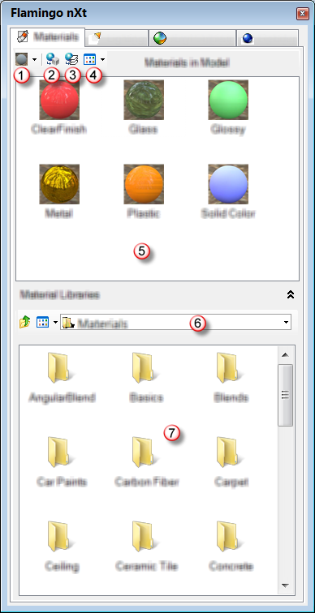

---
---

# 재질
재질은 현재 모델에 저장된 재질 또는 재질 라이브러리에서 선택하여 레이어 또는 개별적인 개체에 적용할 수 있습니다.
레이어에 따라 재질을 적용하는 방법을 권장합니다. 별도의 레이어에서 작업하지 않고, 소수의 개체만으로 작업하는 경우에는 개체마다 재질을 적용하십시오.

## Assign materials to layers
{: #bylayer}
{: #assign-materials}
"재질을 레이어에 적용"은 하나의 재질을 해당 레이어에 있는 모든 개체에 적용합니다.

##### Assign a material to a layer
1. Rhino에서 **레이어** 대화상자를 엽니다.
1. Select one or more layer names, and click the **Material** column.
1. In the **Material Editor** dialog box, under **Assign By**, click **Plug-in**.
1. Click the **Browse** button.
1. In the **Flamingo Materials** dialog box, select a material either from the **Materials in Model** palette or from the **Material Libraries**, and click **OK**.

##### Drag a material to a layer
{: #drag-dropmaterialtolayer}
1. Rhino에서 **레이어** 대화상자를 엽니다.
1. In the **Flamingo nXt [Control Panel](welcome.html#control-panel) **, on the **Materials** tab, drag a material either from the **Materials in Model** palette or from the **Material Libraries** on to a layer name.

##### Remove a material from a layer
{: #detachmaterialfromlayer}
1. Rhino에서 **레이어** 대화상자를 엽니다.
1. Select one or more layer names, and click the **Material** column.
1. In the **Material Properties** dialog box, under **Assign By**, click **Basic**.
1. If desired, reset the material color.

## Assign material to objects
{: #byobject}
재질 라이브러리에서 레이어 또는 개체로 재질을 지정할 수 있습니다.
레이어에 따라 재질을 적용하는 방법을 권장합니다. 별도의 레이어에서 작업하지 않고, 소수의 개체만으로 작업하는 경우에는 개체마다 재질을 적용하십시오.

##### Assign a material through object properties
1. Select objects.
1. On the **Edit** menu, click **Object Properties** command to edit the object.
1. In the ** [Properties](properties-object.html) ** dialog box, on the **Material** page, under **Assign By**, click **Plug-in**, and then click the **Browse** button.
1. In the **Flamingo Materials** dialog box, select a material either from the **Materials in Model** palette or from the **Material Libraries**, and click **OK**.

##### Drag a material onto a single object
{: #drag-dropmaterialtoobject}

>In the **Flamingo nXt [Control Panel](welcome.html#control-panel) **, on the **Materials tab**, drag a material either from the **Materials in Model** palette or from the material library onto an object.

##### Assign a material to selected objects
1. Select objects.
1. In the **Flamingo nXt [Control Panel](welcome.html#control-panel) **, on the **Materials** tab, right-click a material from the **Materials in Model** palette.
1. On the menu, click **Assign to Selected Objects**.

## Select objects with material assignment
{: #select-objects-with-material-assignment}
1. In the **Flamingo nXt [Control Panel](welcome.html#control-panel) **, on the **Materials** tab, right-click a material from the **Materials in Model** palette.
1. On the menu, click **Select Objects with this Material**.

## Remove a by-object material assignment
{: #removematerialfromobject}
1. Select objects.
1. On the **Edit** menu, click **Object Properties**.
1. In the ** [Properties](properties-object.html) ** dialog box, on the **Material** page, under **Assign by**, select **Layer**.

## Manage Materials
{: #manage-materials}
1. On the **Flamingo nXt** menu, click **Control Panel**.
1. In the **Control Panel**, click the **Materials** tab.
&#160;

>New material menu
>Assign to object
>레이어에 적용
>View menu
>Materials in Model palette
>Material library name
>Material Library folders

&#160;

>Drag materials from the library folders to the **Materials in Model** palette or directly onto objects or layers.
>Drag materials from the **Materials in Model** palette onto objects or layers.
>Double-click a material thumbnail in either the Materials in Model palette or a library to edit the material.

## Materials Toolbar

### Create new material
{: #create-new-material}
{: #material-template}Choose a material template. Templates provide preset values to help start a material.

#### New [Solid Color Material](simple-material-properties.html#solid-color) 

#### New [Metal Material](simple-material-properties.html#metal) 

#### New [Plastic Material](simple-material-properties.html#plastic) 

#### New [Glass Material](simple-material-properties.html#glass) 

#### New [ClearFinish Material](simple-material-properties.html#clearfinish) 

#### New [Glossy Material](simple-material-properties.html#glossy) 

#### New [Textured Material](simple-material-properties.html#textured) 

#### New [Texture Set Material](simple-material-properties.html#texture-set) 

#### New [Advanced Material](advanced-material-properties-main.html) 

###  [Assign to selected objects](#byobject) 

###  [Assign material to layers](#bylayer) 

### 뷰 메뉴

#### Large thumbnail view

#### Thumbnail view

#### List view

##### Right-click thumbnail to

### List View

### Thumbnail View

### Large Thumbnail View

### Export Materials to Folder
{: #exportallmaterials}

### Import from File

###  [Assign to Selected objects](#bylayer) 

###  [Assign to Layer](#byobject) 

### Select Objects with this Material

### Duplicate

### Delete
{: #-delete}

### Rename

### Properties

## Library panel
{: #library-panel}

### Hide Library panel

### Show Library panel

### Go up one level

### 뷰 메뉴

### 폴더 이름

## Right-click panel to

### List View

### Thumbnail View

### Large Thumbnail View

### 한 단계 위로

### Back

### Forward

### Browse for Folder

### Default Folder

### Add to Library List

### Remove from Library List

### Rename

### Delete
