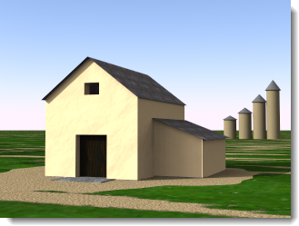
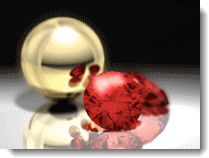

---
---

# Render Window
렌더링 창에는 노출을 조정하고 후처리 효과를 더하는 옵션이 있습니다.

## File menu
{: #renderwindowfile}

### Save
{: #save}
Saves the image to file including alpha channel if the image format supports it. Does not save other rendered channels or [exposure](#adjust-image).
저장 단추를 사용하여 렌더링을 몇 가지 다른 이미지 형식으로 저장할 수 있습니다.

#### JPEG Bitmap (.jpeg, .jpg)
{: #jpg}
알파 채널 없이, JPEG 압축된 (손실 허용 압축) 24비트로 저장합니다.

#### Portable Network Graphics (.png)
{: #png}
알파 채널이 포함되지 않고, 비손실 압축된 24비트 RGB로 저장합니다.

#### Tagged Image File Format (.tif, .tiff)
{: #tif}
Saves uncompressed 24-bit RGB with no [alpha](environment-tab.html#alpha) channel.

#### Windows Bitmap (.bmp)
{: #bmp}
알파 채널 없이, 압축되지 않은 24비트 RGB 컬러로 저장합니다.

### Save with background alpha channel
{: #save-with-alpha-channel}
알파 채널 배경을 포함한 32 비트 PNG, TIF, BMP 이미지를 저장합니다. 파일 형식의 알파 채널 버전은 높은 수준의 합성에 사용됩니다. 알파 채널과 함께 렌더링을 저장하면 배경이 검정색으로 표시됩니다.

### Print
{: #print-preview}
{: #renderwindowprint}
Opens the **Print Preview** dialog box.

#### Print
인쇄 대화상자를 엽니다.

#### Landscape
이미지를 종이에 가로로 인쇄합니다.

#### Portrait
이미지를 세로로 인쇄합니다.

#### Close
인쇄 미리보기 대화상자를 닫습니다.

### Export to native Flamingo nXt file (.nXtImage)
{: #export-to-nxtimage}
Saves uncompressed luminance and color information. Saves all rendered channels including [alpha](environment-tab.html#alpha). The nXtImage files can be opened in the [Image Editor](image-editor.html) where [exposure](#adjust-image) and [post-processing effects](#effects) can be applied and the image re-saved to another bitmap format.
The .nXtImage format is the native image format of the nXt renderers. It is the recommended format for storing your renderings, since it preserves the most information about your rendering. Images stored in this format can be manipulated in the [nXt Image Editor](image-editor.html) and special effects can be added. From this editor, you can save to many popular standard formats, including all of the formats supported in nXt. You can also save to [Piranesi EPix file (.epx)](http://www.piranesi.co.uk/) format.

### Export to HDR file
{: #export-to-hdr}
압축되지 않은 휘도와 색 정보를 저장합니다. hdr 형식은 High Dynamic Range 형식에 있는 휘도 데이터를 직접 저장합니다. 일반 사진처럼 휘도가 없는 배경을 이러한 형식으로 저장하면 검정색으로 나타납니다.

### Export to EXR file
{: #export-to-exr}
A&#160;high-dynamic-range image file format, released as an&#160;open standard&#160;along with a set of software tools created by&#160;Industrial Light and Magic (ILM), released under a&#160;free software license. This file format supports 16-bits-per-channel&#160;floating-point&#160;values (half precision) with a sign bit, five bits of exponent, and a ten-bit&#160;mantissa. This allows a dynamic range of over thirty&#160;stops&#160;of exposure. See: [Wikipedia article: OpenEXR](http://en.wikipedia.org/wiki/OpenEXR).
exr 형식은 High Dynamic Range 형식에 있는 휘도 데이터를 직접 저장합니다. 일반 사진처럼 휘도가 없는 배경을 이러한 형식으로 저장하면 검정색으로 나타납니다.

## Exit
렌더링 창을 닫습니다.

## Edit menu
{: #renderwindowedit}

### Copy
{: #copy}
Windows 클립보드에 이미지 복사본을 배치합니다.

## 뷰 메뉴
{: #view}

### Zoom
{: #zoom}
이미지 뷰를 확대합니다.

#### 실제 크기

#### Zoom In

#### Zoom Out

#### Zoom Extents

### Rendered Display
{: #rendered-display}
원래 렌더링된 이미지를 표시합니다.

### Alpha Mask
{: #alpha-mask}
Displays the [alpha mask](image-editor.html#alpha-channel).

### Distance Mask
{: #distance-mask}
Displays the [distance mask](image-editor.html#distance-channel).

### Hide toolbar
도구모음을 닫습니다.

### Help
{: #help}
Flamingo 도움말을 표시합니다.

## Stop/Resume Rendering
{: #resume-rendering}
이미지 렌더링을 중지/계속합니다.

## Toolbar

###  [Save](render-window.html#save) 

###  [Save with background alpha channel](render-window.html#save-with-alpha-channel) 

###  [ [Print](render-window.html#renderwindowprint) ](render-window.html#print-preview) 

###  [Export to native Flamingo nXt file (.nXtImage)](render-window.html#export-to-nxtimage) 

###  [Export to HDR file](render-window.html#export-to-hdr) 

###  [Export to EXR file](render-window.html#export-to-exr) 

###  [Copy to clipboard](render-window.html#copy) 

###  [실제 이미지 크기로 확대/축소](render-window.html#zoom) 

###  [Rendered Display](render-window.html#rendered-display) 

###  [Alpha Mask](render-window.html#alpha-mask) 

###  [Distance Mask](render-window.html#distance-mask) 

### Options

#### Pan increment
{: #pan-increment}
화살표 키를 사용하여 초점 이동할 때, 몇 개의 픽셀 만큼 초점 이동하는지를 지정합니다.

#### Zoom increment
{: #zoom-increment}
마우스 휠을 돌리거나, + 또는 - 키를 눌러 뷰를 확대/축소할 때 렌더링 창의 이미지 비율을 지정합니다.

### Show/Hide menu

###  [Help](render-window.html#help) 

## Progress
{: #progress}

### 동작

### Pass

### Scan line

### Elapsed time

### Rays / second

### Pixels / second

## Render Constraints
{: #number-of-passes}
{: #time}
{: #render-constraints}

## Adjust Image
{: #adjust-image}
화면 디스플레이를 제어하는 설정으로, 해당 디스플레이에서 만들어진 이미지 파일도 제어합니다. 다른 노출이 설정된 여러 개의 이미지 파일도 하나의 렌더링에서 저장할 수 있습니다. 렌더링된 이미지 하나의 노출 설정이 다음 이미지에도 적용됩니다.
This adjustment process is called *tone mapping.* Tone mapping is the process of converting the luminance data used by Flamingo nXt into&#160;Red, Green, and Blue (RGB) pixels that can be displayed or printed.

### Brightness
{: #brightness}
이미지의 전체 밝기를 조정합니다. 예를 들어, 모델에서 하얀 서피스가 회색으로 렌더링되면 서피스가 하얗게 보일 때까지 밝기를 증가시킵니다. 또는, 실외 장면에서 노출이 지나치면 장면이 올바르게 보일 때까지 밝기를 낮춥니다.

*Brightness at default (left) and increased.*

### Burn
{: #burn}
Adjusts the image white point. This is the brightest white color in the image. Burn can add drama, life,&#160;and sharpness to a rendering by adding more areas of white to contrast with the dark areas.
See [Wikipedia article: White point](http://en.wikipedia.org/wiki/White_point).

*Burn at the default setting (left) and increased.*

### Saturation
{: #saturation}
채도는 이미지에서 색의 양(量)를 제어합니다. 채도가 0.00이면 회색조 이미지가 됩니다. 1.00을 초과하는 값은 색을 진하게 만듭니다.

*Saturation at the default (left) and increased by about 3 (right).*

### Histogram
{: #histogram}
이미지에서의 배광과 어두운 부분을 그래픽으로 표시합니다.
See: [Wikipedia article: Histogram](http://en.wikipedia.org/wiki/Histogram). The internet has many articles about using histograms to evaluate exposure in digital photography. The principles are the same for rendering.

*Histogram.*

#### Histogram options

>Right-click the histogram image for options

#### Fit

#### Median

#### Mean

#### Show Sorted Graph

#### Show Scale

#### Graph Color

#### Show Luminance Values

### Lock exposure
{: #lock-exposure}
노출 설정이 잠겨 있으면, 조명을 변경해도 이에 맞춰 보정되도록 노출이 조정되지 않습니다.

## Information
{: #information}

### Resolution
Displays the [render resolution](render-tab.html#resolution).

### Faces
모델을 렌더링하는 데 사용된 메쉬 면의 수를 표시합니다.

### Apparent faces
When there are blocks in the model, Flamingo nXt is able to use the block definition to render block instances without remeshing each instance. The **Apparent faces** display shows how many additional temporary faces are generated.

## Pixel information
창의 점
이미지 점
이미지 Y가 위로
픽셀의 색
Luminance
거리

## Lighting information

###  [Presets](lighting-tab.html) 

###  [태양](sun-and-sky-tabs.html#sun) 

###  [Sky](sun-and-sky-tabs.html#sky) 

###  [Lights](lights-tab.html) 

###  [Indirect](lighting-advanced-tab.html#indirect) 

###  [Ambient On/Off](lighting-advanced-tab.html#ambient) 

## Channels
{: #channels}
조명 채널의 상태를 표시합니다.

## Effects
{: #post-process-effects}
{: #effects}
후처리 효과는 이미지가 렌더링된 후에 적용되며, 목록에서 설정/해제하거나 순서를 다시 지정할 수 있습니다. 각 효과별로 설정이 있습니다.

## Effects Options
이 옵션은 상황에 맞는 메뉴에서도 사용할 수 있습니다.

>Right-click an effect to display the context menu.

Toggle the on/off state of the selected effect.
Move the selected effect up in the list.
Move the selected effect down in the list.
Selected effect properties.
Save the current effects list order and properties as default.
Save the current effects list as named list.
Import named effects list.

## Depth of Field
{: #postprocessingdof}
피사계 심도 효과는 카메라로부터의 거리에 따라 이미지에 흐림 효과를 줍니다.

## 피사계 심도 속성
{: #depth-of-field-properties}

### Visual Properties
{: #dofvisualproperties}

#### Blurring strength
{: #dofblurringstrength}
흐림의 정도를 결정합니다. 이 값은 임의의 값이며, 서로 다른 이미지에 다른 값을 적용하는 것이 적합합니다.

#### Max blurring
{: #dofmaxblurring}
사용되는 최대 흐림 반지름을 결정합니다. 극도로 흐린 영역에서는 효과의 속도가 느려지므로, 이 설정으로 효과를 제한합니다.

### Area of Effect
{: #dofareaofeffect}

#### Focal distance
{: #dofocaldistance}
카메라로부터, 이미지에 초점이 맞춰져 있는(흐리지 않은) 지점까지의 거리입니다.

#### Pick
초점 거리를 설정하기 위해 이미지에서 한 점을 지정합니다.

#### Blur background
{: #dofblurbackground}
배경의 흐림 여부를 결정합니다. 최대 효과에서 배경이 흐리게 처리됩니다.

## Fog
{: #postprocessingfog}
안개 효과는 심도 의존 색상 (depth-dependent coloration) 을 이미지에 더합니다. 이 효과는 짙은 안개 효과나, 은은하게 깊이를 나타내는 단서(depth cue)로도 사용할 수 있습니다.

*No post processing effects.*

### Fog as Gradient Background
안개를 사용하여 그라데이션 배경을 만들 수 있습니다.
이와 같은 경우에 배경을 만드는 설정은 다음과 같습니다:
Strength = 1Noise = .1Fog Color = BlackEnd distance = approximately 110Start distance = approximately 90Fog Background = OnFeathering = 80

*Fog as gradient background.*

## Fog Properties
{: #fogsettings}

### Visual properties
{: #fogvisualproperties}
안개 효과의 표시 정도를 결정합니다.

#### Strength
{: #fogstrength}
Determines the maximum amount of fogginess. Setting Strength to 0.0 turns the effect off; setting Strength to 1.0 represents total fog. Values higher than 1.0 can be used but only make sense when used with the **Noise**.

#### Noise
{: #fognoise}
Adds a random variation to Fog **Strength**.

#### Color
{: #fogcolor}
안개의 색을 지정합니다.

>Click the color swatch to select a color from the [Select color](select-color.html) dialog box.
>Click the **Pick** button to select the color from the rendered image.

### Area of effect
안개 효과에 둘러싸이는 영역을 결정합니다.

#### Start distance
{: #fogstartdistance}
카메라로부터, 안개가 사라지기 시작하는 거리를 지정합니다.

>Click the **Pick** button to pick the depth from the rendered image.

#### End distance
{: #fogenddistance}
카메라로부터의, 안개가 최대치가 되는 거리를 지정합니다.

>Click the **Pick** button to pick the depth from the rendered image.

### Bounds (Left, Right, Top, Bottom)
{: #fogbounds}
Specifies the area of the image affected by the fog. This can be used to create a low-lying mist effect.
Click the **Pick Area** button to pick bounding area from the rendered image.

### Fog

#### Fog background
Determines whether the background image is also made foggy. The background will be fogged at the maximum strength.

#### Feathering
{: #fogfeathering}
Determines the number of pixels outside the bounding area to “fade in” the fogginess.

### Preview
값을 변경하면 그에 따라 달라지는 이미지 효과를 미리 봅니다.

## Glare
{: #postprocessingglare}
글레어와 글로우는 매우 비슷합니다. 글로우는 선택된 색을 사용하는 반면에, 글레어는 색을 흰색으로 보이게 합니다. 글레어는 이미지에서 극도로 밝은 부분이 글레어로 나타나게 하며, 밝은 부분을 둘러싼 부분을 더욱 밝게 하는 방법으로 이를 실행합니다. 대개 야간 장면에 매우 은은한 글레어 효과가 사용되며, 빛이 더욱 사실적으로 표현됩니다.

*Glare off (left) and on (right).*

## Glare Properties
{: #glaresettings}

### White point bound
{: #glarewhitepointbound}
Determines where in the tonal range the glare will begin. The value is represented on the histogram and can be adjusted graphically. Pixels lighter than the **White Point Bound** (in either luminance or the grey-scale value) will glare.

### Glare size
{: #glaresize}
밝은 픽셀을 둘러싼 글레어의 반지름.

### Gain
{: #glaregain}
게인이란 글레어 밝기의 승수(乘數:곱하는 수)입니다. 기본값인 1.0은 보통 글레어 효과를 나타냅니다. 그보다 높은 값을 사용하면 극도로 밝은 글레어 효과를 얻을 수 있습니다.

### Use photometric information
{: #glareusephotometric}
When using photometric information, the amount of glare is controlled by how &quot;whiter than white&quot; the pixel is. Otherwise, the effect uses the whitest pixels in the image.

### Histogram
{: #glarehistogram}
명암의 분포를 그래픽으로 표시합니다.

#### Histogram options

>Right-click the histogram image for options

#### Fit

#### Median

#### Mean

#### Show Sorted Graph

### Preview
값을 변경하면 그에 따라 달라지는 이미지 효과를 미리 봅니다.

## Glow
{: #postprocessingglow}
글로우 효과는 특정 색 주변에 밝은 부분을 만듭니다. 유색 조명을 만들거나, 네온 조명과 같은 개체를 빛나게 할 때 사용합니다. 이미지에 효과를 주는 10개의 색까지 선택할 수 있습니다.
그림에서 루비의 빨간색이 게인 설정과 함께 사용되어 흰색에 가까운 색이 되었습니다.

*Glow as sparkle.*

*Glow off (left) and on (right).*

## Glow Properties
{: #glowsettings}

### On
해당하는 색상이 글로우에 표시되도록 합니다.

### Color
{: #glowcolor}
글로우의 색을 지정합니다.

>Click the color swatch to select a color from the [Select color](select-color.html) dialog box.
>Click the **Pick** button to select the color from the rendered image.

### Sensitivity
{: #glowsensitivity}
해당 색과 가까운 픽셀에서 글로우를 계산할 때 선택된 색 변형이 얼마나 허용되는지를 제어합니다.

### Glow Size
{: #glowsize}
밝은 픽셀을 둘러싼 글로우의 반지름.

### Gain
{: #glowgain}
게인이란 글로우 밝기의 승수(乘數:곱하는 수)입니다. 기본값인 1.0은 보통 글로우 효과를 나타냅니다. 그보다 높은 값을 사용하면 극도로 밝은 글로우 효과를 얻을 수 있습니다.

### Preview
값을 변경하면 그에 따라 달라지는 이미지 효과를 미리 봅니다.

## Wires &amp; Text
{: #postprocessingwireframe}
렌더링된 이미지 위에 커브, 텍스트, 치수, 아이소커브, 메쉬 가장자리, 점 개체를 오버레이합니다.

*With (left) and without Wires &amp; Text (right).*

## Wires and Text Properties

### Curves
커브 개체를 표시합니다.

### Dimensions and text
치수와 텍스트 개체를 표시합니다.

### Isocurves
서피스 아이소커브를 표시합니다.

### Mesh edges
메쉬 가장자리를 표시합니다.

### Points
점 개체를 표시합니다.

### Preview
값을 변경하면 그에 따라 달라지는 이미지 효과를 미리 봅니다.
