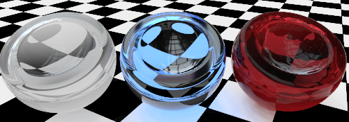
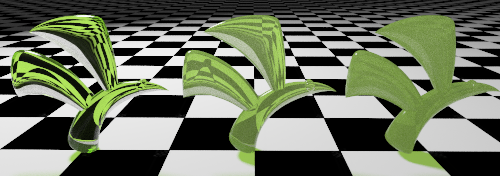

---
---

# Advanced Material Properties: Transparency
The Transparency settings control&#160;properties associated with light passing through a material.

### Transparency
Changes the material from opaque to transparent. Transparent materials increase rendering time.

### Index of Refraction
{: #index-of-refraction}
Determines how much refraction occurs when looking through the material at objects beyond.

The following table shows some examples of index of refraction:

### Material

### IOR
Vacuum
1. Air
1. Ice
1. Water
1. Glass
1. Emerald
1. Ruby/Sapphire
1. Diamond
1. 
### Translucency
{: #translucency}
A measure of diffusion. High translucency produces a “sandblasted” effect, since more light is scattered randomly through the material.

### Scattering
{: #scattering}
Controls the probability of the light encountering a particle per unit length.
 **Note** : The&#160; [Path Tracer](render-tab.html#path-tracer) &#160;is required for this effect.
Subsurface scattering permits light to penetrate the object's surface and scatter in any direction. Many translucent materials can be modeled using this effect. Certain surfaces, such as stone or skin can be realistically “softened” by allowing the light to penetrate a short distance.
The material must have some transparency in order for sub-surface scattering to take place. This is a volumetric effect. The objects with this material attached must be solid or “space enclosing” for this to work properly.

### Attenuation
{: #attenuation}
Determines how much light is absorbed as it passes through the object— greater values produce a more cloudy appearance. Use **Attenuation** to model liquids. Clear liquids have low **Attenuation** ; murky liquids have higher **Attenuation** values.

### Dispersion
{: #dispersion}
Controls how much light is split into its component wavelengths.

### Saturation
{: #saturation}
Determines the amount of dispersion.

### Blurry Transparency
{: #blurry-transparency}
When a material is partially transparent, a little noise is introduced into the transparency, to make the material look more natural.

#### Blurriness
Controls the amount of noise added.

### Glow
{: #glow}
Creates the illusion of illumination.

