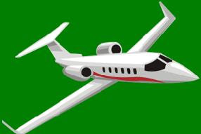
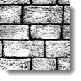

---
---

# Texture Properties: Main

Materials can be created from images. Scan photographs and real materials like wallpaper and carpet, create patterns in a paint program, or use images from other sources of bitmap.
Imagine that the material stretches infinitely in all directions in space. The material becomes visible only where an object passes through it. Patterns are repeated infinitely (tiled) in four directions at a specified scale.
Small images that can be seamlessly tiled tend to work best. If the bitmap does not tile well, use the option to mirror the tiles. This guarantees matched edges.
 **Note** : To make a bitmap image cover only part on the object (like a label on a wine bottle or a logo on a product), use the [Decal](properties-decal.html) feature instead.
Image maps can be used many ways. A common method is to use a picture of a real-world material as the materials color.

### File name
The name of the image file.

### Image preview
Displays a preview of the selected image file.

### Image resolution
Displays the resolution in pixels of the image file.

### Tiles
Image maps used in material definitions are always repeated (tiled). These settings specify how large each instance (tile) will be in current model units.

#### Width/Height
Sets the tile size.

#### Mirror tiles
Mirrors the map in both directions as it is tiled. This can sometimes produce adequate results using bitmaps that do not tile correctly by guaranteeing that the tile edges are continuous.


### Show masked colors
Graphically displays the effects of masking as the parameters change. Use the'../General/select_color.htm');" ehlpsource="robohelp classic" class="hcp1" id="a169" style="position: relative;">color swatch
provided to select the display color of the masked pixels. Changing this color or the setting of the checkbox does not change the masked color. This is simply a graphical tool for editing the mask.

## Mapping type

### Standard
The image provides color and visual bump to the material.

### Strength

#### Color
Determines how much the image map influences the appearance of the material. In the example below, the underlying material is magenta colored. The color strength increases until the underlying color is completely masked by the black and white texture.
 *Color strength 0.2, 0.5, 1.0.* 

#### Bump
Simulates bumps and wrinkles on the surface of an object by perturbing the&#160;surface normals&#160;of the object. The underlying object is not changed.&#160;In the illustration, the material on the left uses displacement mapping, while the material on the right uses bump mapping set at its highest value. The edge and shadow are smooth for the bump-mapped material. See: [Wikipedia article: Bump mapping](http://en.wikipedia.org/wiki/Bump_mapping).
 *Bump strength, 0.5 (left) and 1.0 (right).* 

### Normal
Fakes the lighting of bumps and dents without using more&#160;polygons to the render mesh. See: [Wikipedia article: Normal mapping](http://en.wikipedia.org/wiki/Normal_mapping).
Normal maps work similar to bump maps, in that they modify the normal of the surface. The effect is essentially the same as bump; but normal maps allow more control over the normal than a bump. A bump map uses the grey average of the RGB in a bitmap. The RGB of a normal map corresponds to the modification of the XYZ of the normal.

### Displacement
Causes an effect where the actual geometric position of the surface isdisplaced, often along the&#160;local&#160;surface normal. See: [Wikipedia article: Displacement mapping](http://en.wikipedia.org/wiki/Displacement_mapping).
Displaces the material using the color values to move points on the render mesh.
 **Note** : Use displacement mapping sparingly for small objects. Displacement increases rendering time considerably.

#### Height
The height of the highest point of displacement.

#### Offset
Sets the starting point of the displacement with reference to the surface normal.

Z-offset = -1.0

Z-offset = -0.5

Z-offset = 0.0

#### Facet size
The size of the facets of the displacement mesh.

## Advanced
Select the color component of the material that will be affected by the bitmap.

## Surface Component Altered by Map

###  [Base color](advanced-material-properties-main.html#color) 

###  [Specular color](advanced-material-properties-main.html#highlight-color) 

###  [Specular intensity](advanced-material-properties-main.html#intensity) 

###  [Highlight sharpness](advanced-material-properties-main.html#sharpness) 

### Highlight shape
Affects the shape of the highlight.

###  [Transparency](advanced-material-properties-transparency.html) 

###  [Translucency](advanced-material-properties-transparency.html#translucency) 

###  [Attenuation](advanced-material-properties-transparency.html#attenuation) 

### Normal
Affects the direction of the surface normals.

## Orientation

### X/Y Offset
Offsets the material from the x- and y-axis.

###  [Rotation](advanced-material-properties-textures.html#rotation) 

