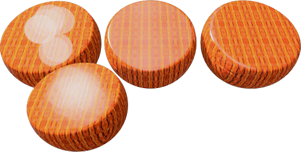
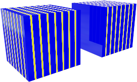

---
---

# Advanced Material Properties: Main

## Basic material properties
{: #basic-materials-properties}


## Reflective Finish and Highlight
{: #reflective-finish-and-highlight}
이 설정은 재질과 개체가 빛을 반사하는 방식에 변화를 줍니다. 하이라이트 효과는 일반적으로 빛이 광택 재질에 닿아 빛나는 부분과 관계가 있습니다.
 **Note** : To activate these settings, the **Intensity** value must be greater than zero.

### Highlight color
{: #highlight-color}

#### White
하얀 하이라이트를 가진 재질은 플라스틱처럼 보이는 경향이 있습니다.

#### Metallic
{: #metallic}
기본색과 일치하도록 하이라이트 색을 설정합니다.
 **Note** : Chrome and other reflective materials do not make an interesting image unless they have something to reflect. Simply applying a reflective metal material to an object is not enough.

#### Custom
하이라이트에 사용할 색을 지정합니다.

### 강도
{: #intensity}
하이라이트의 강도를 조정합니다. 큰 값은 하이라이트의 크기와 세기를 높입니다.

### Fresnel
{: #fresnel}
Pronounced (fray-NELL) Controls the reflectivity of opaque materials, a phenomenon known as [Fresnel reflection of conductors](http://en.wikipedia.org/wiki/Fresnel_equations) .The Fresnel setting &#160;models the tendency of many materials to become more specular (mirror-like) at glancing angles while retaining more matte properties at perpendicular viewing angles.
Reduce the value for very dark materials to prevent too much reflection.&#160;Increase the value for materials like varnished wood, where the Fresnel reflectivity is more pronounced.

### Sharpness
{: #sharpness}
하이라이트의 크기를 설정합니다. 숫자가 작을수록 더 넓은 하이라이트가 지정됩니다. 숫자가 클수록 더 작은 하이라이트 영역으로 초점이 맞춰집니다.

### Type
{: #type}
인공 광원이 반사될 때의 반사 계산 방식을 변경합니다.
Reflections are calculated using two methods: *raycasting* and *highlight*. These two methods will eventually produce identical results; however, in certain situations, you will find that one method gets a good result more quickly. For example, objects might not look good because a light source reflection hides the material's appearance.
In the illustration below for **Balanced** type, the object on the left has a bright white reflection that overpowers the material's appearance.
 **Note** : Blurry reflections of light sources can be associated with interior renderings where the light sources are small. The surfaces exhibiting the artifact typically have blurry reflections. Changing the type to [Glossy](advanced-material-properties-main.html#glossy), [No Light Source Reflections](advanced-material-properties-main.html#no-light-source-reflection), or [Monte Carlo](advanced-material-properties-main.html#monte-carlo) can help alleviate this problem.

#### Balanced
{: #balanced}
Automatically balances raycasting and highlight based on the **Sharpness** setting. Both the actual reflection of the light source and the artificial highlight are calculated.

#### Glossy
{: #glossy}
하이라이트의 흐린 정도를 증가시키고 레이캐스팅을 방지합니다. 개체 또는 빛의 반사가 계산되지 않으므로 따라서 성능이 향상되고 매우 흐리게 반사되는 재질의 아티팩트도 방지됩니다. 은은한 반사는 일부 손실될 수 있습니다.

#### Monte Carlo
{: #monte-carlo}
오직 레이캐스팅만이 광원 반사 계산에 사용됩니다. 레이캐스팅 초기에는 매우 노이즈가 많으며 점차 올바르게 수렴됩니다. 하이라이트가 흐리지 않을 때 가장 유용합니다.

#### No Highlight
{: #no-highlight}
오직 레이캐스팅만이 광원 반사 계산에 사용됩니다. 광원이 크고 재질이 흐리지 않아 하이라이트 계산에 시간이 오래 걸릴 수 있을 때 유용한 방식입니다. 광원 반사는 점차적으로 수렴됩니다.

#### No Light Source Reflection or No Highlight
{: #no-light-source-reflection-and-no-highlight}
인공 광원의 모든 반사와 인공 하이라이트 효과가 제외됩니다. 개체 반사는 여전히 계산됩니다.

#### No Light Source Reflections
{: #no-light-source-reflection}
광원의 레이캐스트 반사가 제외되고, 하이라이트만 사용됩니다. 재질이 흐리고, 장면에 작고 밝은 광원이 있을 경우, 스펙클 아티팩트를 방지하는 데 종종 유용하게 사용됩니다.

### Template
{: #template}
Indicates the template used with the [Simple Material Properties](simple-material-properties.html) dialog box.

### Simple Editor
{: #simple-editor}
Opens the [Simple Material Properties](simple-material-properties.html) dialog box. The more commonly used settings are available in this editor.

## Procedures
{: #procedures}

### Base]
{: #material-procedure-base}
The **Procedures** tree combines one or more materials using a set of rules for how the materials interact. The tree displays the components used to create the material and lets you add components. For simple materials, there will be only one component in the list: **Base**.
Each procedure combines two &quot;child&quot; materials using a specific method. Each of these child materials can in turn consist of a procedure, combining two children of its own. In this way, extremely elaborate materials can be built from simpler constituents. Procedures for combining materials include [angular blend](advanced-material-properties-main.html#angular-blend), [blend](advanced-material-properties-main.html#blend), [marble,](advanced-material-properties-main.html#marble)  [granite](advanced-material-properties-main.html#granite), [tile](advanced-material-properties-main.html#tile), and [wood](advanced-material-properties-main.html#wood).

##### To add a procedure
1. Right-clickanywhere in the **Procedures** window.
1. On the menu, click a procedure type.
 [Angular Blend](advanced-material-properties-main.html#angular-blend) 
 [Blend](advanced-material-properties-main.html#blend) 
 [Granite](advanced-material-properties-main.html#granite) 
 [Marble](advanced-material-properties-main.html#marble) 
 [타일](advanced-material-properties-main.html#tile) 
 [Wood](advanced-material-properties-main.html#wood) 

##### To remove a procedure
 1. In the **Procedures** window,right-click the procedure name.
 2. On the menu, click **Remove**.

## Angular Blend
{: ##material-procedure-angular-blend}
두 개의 다른 재질을 블렌드하여 재질의 특징을 화각(畵角) 기반에서 개체의 서피스로 변경하는 재질을 만듭니다.

### 
The **Angular Blend** procedure blends between two different materials to create special effects. Use **Angular Blend** to create materials that change characteristics based on the angle of view to the surface of the object.

### Inner
From 0 degrees from the viewpoint to the **Start angle**, the **Inner** component will show completely. Think of this as a base material.

### Outer
From the **Stop angle** to 90 degrees from the view, the **Outer** component will be the only material showing. Think of this as a coating.

### Start angle
The angle from the viewpoint at which the **Outer** component material starts.

### Stop angle
The angle from the viewpoint at which the **Outer** component material stops.
Between the **Start Angle** and the **Stop angle**, the **Inner** and the **Outer** components blend.
Start (1) and Stop (2) angles.
In the illustration, the **Start angle** is 30 degrees (the green circle) and the **Stop angle** is 60 degrees (the red circle).
The **Inner** material is white, and the **Outer** material is black.

>Between 0 and 30 degrees from the viewpoint, you see white.
>Between 30 and 60 degrees&#160;from the viewpoint, you see a gradient from white to black.
>Between 60 and 90 degrees&#160;from the viewpoint, you see black.

## Blend
{: #material-procedure-blend}
The **Blend** procedure combines two base components and controls the proportions of each. All of the standard library wood materials use a **Blend** procedure to change the finish of the wood from clear matte to dark shiny.

기본 패턴 재질에 전체적인 색을 추가하여 전체 재질 정의를 바꿀 때 블렌드가 잘 실행됩니다.

### Blend
각각의 구성 요소 재질이 사용되는 양을 다르게 설정합니다.

### 이미지 사용
Bitmap images usually consisting of grayscale patterns define where two component materials will show. The materials are blended by the value of the gray pixels in the image. Use a grayscale image map to mediate between the first and second components. The **First** component will be placed where there is black in the bitmap pattern, and the **Second** component will be placed where there is white in the bitmap pattern.
그림에서 처음과 두 번째 구성 요소에 모두 동일한 재질이 사용되었으나, 블렌드는 세 개의 다른 비트맵으로 제어됩니다.

마스크 비트맵의 해상도는 재질의 화질에 영향을 줍니다. 비트맵 해상도가 높을수록 화질 문제도 적어지고 시점이 재질에 가까워질 수 있으나, 더 많은 메모리가 소요됩니다.

### Tiles

#### Width
이미지의 단일 인스턴스 너비 (픽셀 단위).
The scale of the material is independent of the resolution of the bitmap used to define it. In order to scale the material correctly, decide how large an area in real units one copy of the bitmap represents. If the bitmap represents the height of six 4-unit tiles and the length represents twelve 4-unit tiles, the scale would be 48&#160;units in the x-direction and 24&#160;units in the y-direction. This stretches the bitmap to the proper size for the pattern.

#### Height
이미지의 단일 인스턴스 높이 (픽셀 단위).

#### Mirror tiles
X와 Y 방향으로 비트맵 이미지를 미러 실행합니다. 반복되는 부분에 보이는 심에서 잘라낼 때 종종 유용하게 사용됩니다.

### 알파 채널 사용
색이 블렌드되는 곳을 결정할 때 이미지에 알파 채널이 있으면 비트맵 회색조 대신 알파 채널이 사용될 수 있습니다.

### Reverse
The **First** component will be placed where there is white in the bitmap pattern, and the **Second** component will be placed where there is black in the bitmap pattern.

## Granite
{: #granite}
Creates a 3-D material with solid pockets of a second material embedded in the **Base** component. The **Granite** procedure combines a randomly distributed **Spot** component in a **Base** component. The **Granite** procedure defines how the **Base** and **Spot** components combine. **Granite** procedures can be used for a variety of different materials including rust, sparkly plastic, and other randomly spotted materials.

### Base/Spot
The **Base** and **Spot** components are two materials. Their properties are specified in the same way as any material.


### Density
전체 패턴의 일부. 이 설정값을 높이면 반점의 상대적 크기도 커집니다.



## Marble
{: #material-procedure-marble}
Creates alternating slabs of **Base** and **Vein** components.

### 
The **Marble** procedure defines how the **Base** and **Vein** components combine. The slabs are infinitely large, and the orientation of the object affects the way the slabs are oriented with respect to the object. Texture [mapping](properties-object.html#mapping) for the objects controls the orientation of the material on the object.

텍스처 매핑 없음 (왼쪽). 텍스처 매핑 적용 상태 (오른쪽).

### Base/Vein
The **Base** and **Vein** components are two materials. Their properties are specified in the same way as any material.


### Vein Width
Alters the relative size of the slabs to each other. **Vein Width** is a fraction of the distance from one **Base** stripe to the next. Values range from 0 (zero) for no **Vein** component to 1 for no **Base** component.



Veneer (left), normal (right).

## Tile
{: #material-procedure-tile}
Tile is a 2-D material.&#160;Texture [mapping](properties-object.html#mapping) for the objects controls the orientation of the material on the object. The **Tile** material combines a **Base** component and a **Joint** component. Each of these materials can also include any other material.

특수 효과를 주려면 타일 크기를 각 방향마다 다르게 설정합니다. 예를 들어, 한쪽에는 극도로 긴 타일 재질을 사용하여 사이딩 재질로 만듭니다.

### Tile
전체 타일 크기를 설정합니다. 너비와 높이는 독립적으로 설정할 수 있습니다.

#### Width/Height
타일의 너비와 높이를 지정합니다.

### Joint
이음 재질의 크기를 지정합니다.

#### Horizontal joint/Vertical joint
이음 재질의 너비와 높이를 지정합니다.

#### Lock
Maintains the ratio between the **Horizontal** and **Vertical joint** sizes.

#### Offset
Provides a relative horizontal offset per vertical tile.&#160;For example, use a setting of .5 to produce a standard running bond. This allows modeling of material such as marble tile, without the effect of having the entire floor hewn from the same block of marble.

### Vary Tiles
각각의 타일에 임의의 색상을 가진 재질 색을 더합니다. 불규칙한 벽돌과 같은 재질을 모델링할 수 있습니다.

#### R/G/B
빨강, 초록, 파랑 색 구성요소를 수정합니다.

#### X/Y/Z
절대좌표 원점을 기준으로 재질의 간격을 띄웁니다. 재질의 처음을 나타내는 심이 잘못된 위치에 표시되면 이 옵션을 사용합니다.

## Wood
{: #material-procedure-wood}
Creates concentric cylinders of alternating **Base** and **Ring** components.
Wood consists of concentric cylinders of alternating **Base** and **Ring** components. The Wood settings define how the **Base** and **Ring** components combine.
나무 재질을 만들 때의 사용 방식은 얼마나 가깝게 보이는지에 따라 달라집니다. 나무와 시점이 멀리 떨어져 있다면 화질을 희생하지 않으면서, 나무에 단색을 적용할 수 있습니다. 이렇게 하면 렌더링 속도가 빨라집니다.
나무 재질을 사용하는 장점 중 하나는 한 개체의 다른 면을 렌더링할 때 나뭇결이 정확하게 보입니다. 나무의 횡단결이 양쪽 끝에 보이고 종단결은 개체의 옆면에 보입니다.

### Base/Ring
The **Base** and **Ring** components are two materials. Their properties are specified in the same way as any material.


### Ring Width
A fraction of the distance between one **Base** stripe and the next. Values range from 0 (zero) for no **Ring** component to 1 for no **Base** component.



Veneer (left), normal (right).
