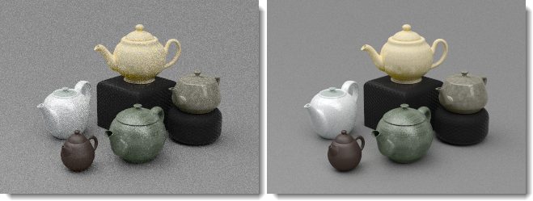
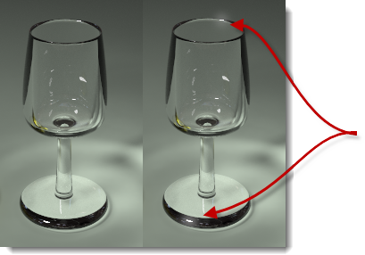

---
---

# Image Editor
nXt 이미지 편집기는 nXt 플랫폼에서 만들어진 원시 이미지 파일 (.nXtImage)을 편집할 수 있습니다. 이 원시 파일에는 렌더링이 실행되는 동안 수집된 모든 정보가 담겨 있습니다.
nXt 이미지 편집기를 사용하여 다음과 같은 기능을 실행할 수 있습니다:

>Adjust the [tone operator](image-editor.html#tone-mapping) settings.
>Change the intensity of any lighting channel.
>Add special image-based effects: [Haze](image-editor.html#haze), [Depth Blur](image-editor.html#depth-blur), and [Glare](image-editor.html#glare).
> [Save](image-editor.html#save-tonemapped-image-as) a tone-mapped image in a bitmap format such as .jpg or .png.
>Save the luminance information to an [HDR format](image-editor.html#save-hdr-image-as).
>View and save additional masked channels ( [alpha](image-editor.html#alpha-channel), [distance](image-editor.html#distance-channel), [material](image-editor.html#material-channel) ) for use in advanced compositing.
>Save a [Piranesi©](http://www.piranesi.co.uk/) file format (*.epx) which can be used to create non photo-realistic rendering.
>렌더 팜에서 별도의 노드로 생성된 이미지를 짜집기하는 등의 작업을 할 때는 이미지를 산술로 설정하여 사용하십시오.
>Save the [Lighting Settings](image-editor.html#save-lighting-settings-as) used to generate this rendering. These Lighting Settings can then be used to generate more renderings.

##### To launch the editor

>On the **Flamingo nXt** menu, click **Utilities &gt; Flamingo nXt Image Editor**.

## File menu
{: #file-menu}

### Open
nXtImage 형식으로 저장된 파일을 편집용으로 엽니다.

### Save Source Image
nXtImage 파일을 저장합니다.

### Save Source Image As
nXtImage 파일을 다른 이름으로 저장합니다.

### Save Tonemapped Image As
{: #save-tonemapped-image-as}
편집된 이미지를 비트맵 이미지 파일로 저장합니다.

>JPEG (.jpg)
>TIFF (.tif)
>TIFF with Alpha Channel (.tif)
>PNG (.png)
>PNG with Alpha Channel (.png)
> [Piranesi EPix file (.epx)](http://www.piranesi.co.uk/) 

Piranesi는 손으로 그린 것처럼 표현된 이미지를 만드는 3D 페인팅 도구입니다.

### Save HDR Image As
{: #save-hdr-image-as}
HDR 파일 (.hdr)
EXR 파일 (.exr)
EXR - 알파 채널 포함 (.exr)

### Save Mask
{: #save-mask}
nXtImage 파일에 있는 3개의 추가적인 채널은, 대부분의 비트맵 편집기에서 높은 수준의 합성 작업을 할 때 사용할 수 있습니다. 이러한 채널의 각 픽셀에는 알파, 거리, 재질 정보가 담겨 있으며, 회색조 이미지로 인코딩됩니다. 이 채널은 png 파일로 보고 저장할 수 있습니다.

## Notes:

>The alpha channel can be included with a tone-mapped image by selecting a file format with Alpha when saving a tone-mapped image.
>Distance and Materials channels are not antialiased and may show some hard-edged artifacts. Adding a small amount of Gaussian blur to a mask before using it may help soften these edges.
>The Materials channel will only uniquely encode 255 different materials. If your model contains more materials than that, some mask colors will repeat.

#### Material Channel
{: #material-channel}
재질 채널 마스크를 저장합니다.

#### Alpha Channel
{: #alpha-channel}
알파 채널 마스크를 저장합니다.

#### Distance Channel
{: #distance-channel}
거리 채널 마스크를 저장합니다.

### Save Lighting Settings As
{: #save-lighting-settings-as}
Saves the [lighting scheme](lighting-tab.html#open-lighting-scheme).

## Image menu
{: #renderwindowimage}

### Info
{: #info}
이미지에 대한 정보를 표시합니다.

### Arithmetic
{: #arithmetic}
Allows piecing together or overlaying segments of images rendered using the [Render Farm Single Image](automate-rendering.html#single-images) function.

##### To piece image segments
1. On the **File** menu, click **Open**.
시퀀스의 첫 번째 이미지를 선택합니다. (예: 000000.nXtImage)
1. On the **Image** menu, click **Arithmetic**, and then click **Add**.
1. Select all of the other images in the sequence.
 **Note** : Do not select the first image (000000.nXtImage) again or it will be added twice.

#### 추가
한 레이어의 픽셀값을 다른 레이어에 추가합니다. 값이 255를 넘으면 (RGB의 경우), 흰색이 표시됩니다.

#### Subtract
다른 레이어에서 한 레이어의 픽셀 값을 뺍니다. 값이 음수인 경우, 검정색이 표시됩니다.

#### Difference
항상 양(+)의 값을 얻기 위해 아래 레이어에서 위 레이어를 (또는 그 반대로) 뺍니다. 모든 색의 값은 0 이므로 검정과 블렌드하면 변화가 없습니다. 흰색과 블렌드하면 그림이 반전됩니다.

#### Masked Add
블렌드할 때 투명한 알파 채널 마스크를 적용시킵니다.

#### Combine Path Tracings
경로 추적기 엔진을 사용하여 렌더링된 이미지를 결합합니다. 예를 들어, 20번의 패스로 렌더링된 10개의 이미지를 결합하면 200번의 패스를 거쳐 렌더링된 이미지와 마찬가지가 됩니다.
* *Rendered with 20 passes (left), ten 20-pass images combined to create a 200-pass image (right).* *

### Apply Patch
{: #apply-patch}
선택된 부분만 렌더링된 이미지를 이미 렌더링된 이미지에 삽입합니다.

### Animation
이미지 정보를 변경하며 애니메이션 실행할 수 있습니다.

##### To animate image effects
1. Set up the first image.
&#160;
Click the **Plus (+)** button next to the **Frame** edit box.
1. Edit the image and add frames.
1. Click **Image &gt; Animation**, and in the dialog box, click **Preview**.
1. If all is well, click **Animate**.
폴더를 만듭니다.
만들어진 이미지 시퀀스로, 애니메이션 제작 용도 소프트웨어를 사용하여 애니메이션을 만들 때 사용할 수 있습니다.

## 뷰 메뉴
{: #view-menu}
이미지에서 무엇이 표시되는지를 지정합니다.

### 이미지
원래 렌더링된 이미지를 표시합니다.

### Image and Alpha Mask
이미지와 알파 채널 마스크를 함께 표시합니다.

### Material Mask
Displays the [material mask](image-editor.html#material-channel).

### Distance Mask
Displays the [distance mask](image-editor.html#distance-channel).

## Using the image editor

##### Load an Image
1.  [Save](render-window.html#export-to-nxtimage) your rendering results as an. **nXtImage**.
1. On the **Flamingo nXt** menu, click **Utilities &gt; Flamingo nXt Image Editor**.
1. In the **nXt Image Editor**, on the File menu, click **Open** to load the image into the editor.

## Tone mapping
{: #tone-mapping}
Tone mapping is the process of converting the luminance data used by nXt into&#160;RGB pixels that can be displayed or printed.

## Tone mapping controls

### Brightness
{: #brightness}
See [Render Window: Brightness](render-window.html#brightness).

### Burn
See [Render Window: Burn](render-window.html#burn) 

### Saturation
See [Render Window: Saturation](render-window.html#saturation) 

### Histogram
See [Render Window: Histogram](render-window.html#histogram) 

## Status Fields
상태 필드는 화면의 아래쪽에 위치합니다. 커서를 이미지에서 움직이면 이 필드에 각 픽셀에 대한 정보가 표시됩니다.

### Pixel
{: #pixel}
왼쪽 아래 모서리를 기준으로 측정된 픽셀 좌표.

### Color
{: #color}
The first three fields display the RGB colors&#160;displayed in the image after tonemapping. The fourth field shows the alpha (transparency) channel, which is used for compositing.

### Value
{: #value}
빨강, 초록, 파랑 하위 채널의 휘도값입니다.

### Lum
{: #lum}
각 픽셀에 저장된 휘도값의 가중 평균.

### Depth
{: #depth}
보는 이로부터 각 픽셀이 떨어져 있는 거리를 미터 단위로 표시합니다. 음의 값은 배경 픽셀을 나타냅니다.

### 재질
{: #material}
픽셀을 렌더링하는 데 사용된 재질의 이름.

## FX Settings

## Haze
{: #haze}
카메라에서 멀리 떨어져 있는 픽셀에 색을 더합니다. 이 효과는 장면에 옅은 안개 또는 안개를 추가하거나, 배경을 색으로 마스크 처리, 배경색을 변경할 때 사용할 수 있습니다.
*Original image (left) and with haze (right).*

### Strength
옅은 안개 색의 강도를 지정합니다.

### Near
옅은 안개가 각 픽셀에 색을 추가하기 시작하는 카메라로부터의 거리.

#### Pick
거리를 지정하기 위해 이미지 상에서 한 점을 지정합니다.

### Far
The distance at which the haze effect will be its maximum.&#160;All pixels beyond this point will have the maximum haze effect added to each pixel.
가까이와 멀리 사이에 있는 픽셀은 가까이에서 멀리 있는 픽셀 선상으로 옅은 안개 효과가 더해집니다.

#### Pick
거리를 지정하기 위해 이미지 상에서 한 점을 지정합니다.

### Color
옅은 안개의 색.

#### Pick
색을 지정하기 위해 이미지 상에서 한 점을 지정합니다.

## Depth Blur
{: #depth-blur}
이미지의 각 픽셀은 거리값을 가지고 있으므로 지정된 거리 사이의 이미지를 흐리게 처리하는 데 사용할 수 있습니다.

*Original image (left) and with depth blur (right).*

### Strength
흐린 정도를 지정합니다.

### Focus
{: #depthblurfocus}
이미지에서 초점이 되는 거리를 지정합니다.

#### Pick
초점 거리를 설정하기 위해 이미지에서 한 점을 지정합니다.

### In-Focus Zone
{: #in-focus-zone}
The distance around the **Focus** that is sharp.&#160;This value is in meters.&#160;All pixels within this distance will be sharp and will be ignored by the Blur filter.&#160;Pixels beyond this distance will be progressively blurred with neighboring pixels to give the illusion of depth of field.

### Blur
Controls which direction the blur filter will work.&#160;The default value is **Background** .&#160;This means all pixels farther away from the camera than the **In-Focus Zone** will progressively blur.
*Blur foreground (left) and background (right).*

#### Background
Blurs pixels farther away from the camera than the **In-Focus Zone** range.

#### Foreground
Blurs pixels that are closer to the camera than the **In-Focus Zone** range.

#### Both
Blur pixels both in front and behind the **In-Focus Zone** range. This is a quick way to get a depth-of-field effect.&#160;It is not as accurate as using the built-in pre-render [Depth of Field](render-tab.html#depthoffieldoption).

## Glare
{: #glare}
Glare affects pixels that are brighter than the Threshold in lumens by creating a halo effect on the surrounding pixels.&#160;Only the brightest pixels in the image are affected.
커서를 픽셀 위에 잠시 두면 글레어가 표시되며, 해당 픽셀의 전체 루멘을 알 수 있습니다.
*Original image (left) and with glare (right).*

### Strength
주변 픽셀에 영향을 주는 후광의 양을 조정합니다.

### Threshold
The lower limit of&#160;the&#160;value affected by the glare filter.&#160;All pixels brighter than this value will be affected.

#### Pick
명도를 지정하기 위해 이미지에서 한 점을 지정합니다.

## Vignette
{: #vignette}
후광 같은 효과를 만들기 위해 이미지의 가장자리 색을 흐리게 처리하고 블렌드합니다.
*Original image (left) and with vignette (right).*
