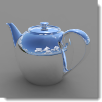
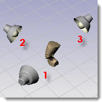
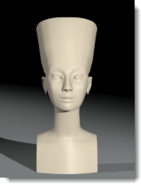

---
---

# Studio Lighting Basics
{: #studio-lighting-bascis}
스튜디오 조명은 포토그래퍼의 스튜디오와 비슷하게 설정되어야 합니다. 전체적으로 제어하기 위해 광원을 사용하여 장면을 비춥니다.

스튜디오 설정 조명에서는 극적인 조명이 중요합니다. 명암을 짙게 만들면 조명을 극적으로 만들 수 있습니다. 이것은 어두운 부분도 밝은 부분만큼 중요하다는 것을 의미합니다. 극적인 조명에는 아주 밝고 아주 어두운 부분을 만드는 방식으로 설치된 일정 수의 조명이 필요합니다.
가장 기본적인 스튜디오 조명 배치는 주광 (1), 보조광 (2), 후광  (3)을 사용하는 것입니다. 스튜디오에서 인물과 개체를 단독으로 두고 촬영할 때 가장 일반적으로 사용하는 조명 배치입니다. 3점 조명 설정을 사용하면 즉시 좋은 결과를 얻을 수 있으며 특수 효과를 만들 때 훌륭한 출발점이 됩니다. 집중 조명은 사용자가 방향을 제어할 수 있어 유용합니다. 또한, 집중 조명이 비춰지는 공간은 장면에 극적인 느낌을 줍니다.

## Camera Angle
{: #cameraangle}
Lighting setups always depend on the angle of the camera to the subject. It is a good idea to start lighting by deciding on the camera angle. Use the **Camera** or **NamedView** commands to set up the position and angle of the camera. This will help determine the position of the lights.

## Basic Three-Light Setup
{: basic-three-light-setup}
기본적인 스튜디오 조명 설정은 3점 조명 (주광, 보조광, 후광) 으로 이루어져 있습니다.

### Key Light
{: #keylight}
주광(key light)은 장면에서 가장 지배적인 조명입니다. 분위기를 결정하고 방향을 알려주며 치수, 텍스처를 보여주고, 가장 어두운 그림자를 만듭니다. 주광은 주제에 따라 대개 개체의 위쪽 옆 30~ 45 도 범위로 설정됩니다.
주광이 카메라와 가까울수록 모델링과 텍스처가 잘 보이지 않습니다. 대개 주광은 렌즈보다 높은 위치에 있으므로 그림자가 아래 방향으로 투사됩니다. 주광을 옆으로 옮기면 개체의 3D 퀄리티가 높아집니다. 전통적인 인물 초상 사진 설정에서 주광은 대상과 카메라 사이에 45도 각도로 그림자를 아래로 드리울 만큼(너무 높아 대상 인물의 눈 위치에 그림자가 지지 않을 만큼)의 높이로 설정됩니다.
주광이 부드러운 빛이라면 보조광은 거의 또는 전혀 필요하지 않습니다. 소규모 스튜디오 설정에서 기본적인 해결책입니다.
주광은 대상체에 그림자를 지게 합니다. 얼굴만 있는 이미지에서는 코 옆에 강한 그림자가 보이는 경우가 많습니다.

### Fill Light
{: #filllight}
보조광(fill light)은 렌즈 바로 위, 주광의 반대쪽에 위치합니다. 그 목적은 가까이 있는 개체에서 반시된 빛을 시뮬레이션하여 명암을 줄이고 그림자 속에서도 세부적인 부분이 보이게 하는 것입니다. 낮은 명암을 얻기 위해 주광과 보조광의 강도를 같게 할 수 있으나, 일반적으로 주광이 보조광보다 더 밝고 강합니다. 보조광은 장면에서 두 번째 조명입니다. 보조광이 장면에 더 어두운 그림자를 만들어서는 안 됩니다.
그림에서 주광만 있을 때보다, 코의 왼쪽 그림자와 전체적인 왼쪽 부분이 더 부드럽고 밝은 그림자로 표시되는 것을 알 수 있습니다.

### Backlight
{: #backlight}
후광(backlight) 효과는 은은하지만 장면에서 개체의 가장자리를 정의하고 배경과 개체가 섞이는 것을 방지하여 깊이를 더합니다. 후광은 대개 뒤에 개체보다 높이 배치되며 카메라를 향합니다.
후광 효과는 후광을 비추는 서피스로부터 반사되는 부분에 따라 달라집니다.
그림에서 어깨 위쪽에 있는 빛이 배경과 대상물이 분리되어 보이게 합니다. 후광은 개체가 있는 서피스를 밝게 비추고 그림자를 부드럽게 표시합니다.

## Light Qualities
{: #lightquality}
정확한 그림자, 하이라이트, 반사를 적용한 이미지를 만들 수 있지만, 올바른 조명 설정 없이는 원하는 목표를 달성하기 어렵습니다. 조명을 설정할 때는 무엇이 목표인지 생각하세요. 이미지는 대담하고 생생하면서 단순할 때 좋은 결과물을 나타냅니다. 유리 그릇에 하이라이트를 너무 많이 주거나, 개체에 그림자가 너무 많으면 장면이 불필요하게 복잡해 보이고 주제와 동떨어져 보일 수 있습니다.
퀄리티 측면에서 고려할 사항:

>The contrast range of the scene
>The depth of the scene (its three-dimensional quality)
>Separation of objects from the background
>Whether the lighting should be hard of soft
>Whether the lighting should be warm or cool in color

### Contrast Range
{: #contrastrange}
명암 범위는 주어진 장면에서 가장 밝은 영역과 어두운 영역 사이의 차이입니다. 사람의 눈은 필름보다 매우 높은 명암 범위를 인식할 수 있으며, 전체를 자세히 보기 위해 지엽적인 부분을 보완할 수 있습니다. 이 효과는 맑은 날 찍은 스냅샷에서 볼 수 있습니다.
특히, 하이라이트 부분이 너무 밝거나 그림자 부분이 너무 어둡더라도 밝고 어두운 부분 모두를 자세히 보는 것은 어렵지 않습니다. 명암 범위는 필름으로 녹화하기에는 지나치게 넓습니다. 렌더링된 이미지에서 컴퓨터가 표시할 수 있는 색채에는 제한이 있는 것이 사실입니다.

이미지의 명암을 낮으면, 하이라이트나 그림자 부분이 세밀하게 표현되지 않는 현상이 방지됩니다.

### Three-Dimensional Quality
{: #three-dimensional}
2D 평면 공간에서 3D(3차원)을 표현하려면 마치 깊이가 있는 것과도 같은 착각을 불러 일으켜야 합니다. 옆에서 빛이 비춰지는 불투명한 개체는 옆에 밝은 하이라이트와 더 어두운 그림자가 표현되므로 깊이가 느껴집니다. 3면이 보이는 상자는 각각의 면이 다른 값을 가지고 있다면 더욱 3차원처럼 보일 것입니다. 실제 상황에서 빛은 대개 위에서 아래로 비춰지므로 윗면이 가장 밝게 보입니다.

### Separation from the Background
{: #separation}
제품이 더 돋보이려면 3D 퀄리티와 전체 명암 범위를 설정하는 것 외에도 배경과도 잘 분리되어 보여야 합니다. 이것은 대상물의 가장자리가 배경보다 확실하게 밝거나 어두워야 한다는 뜻입니다. 개체가 배경과 분리되지 않으면 배경에 섞여 잘 보이지 않게 됩니다.
그림에서 개체 위쪽의 하이라이트는 개체를 배경과 분리시키는 데 도움이 됩니다.
대상물의 그림자는 경우에 따라 분리에 도움이 되거나, 오히려 배경에 포함되게 보이게 만들기도 합니다. 후광을 사용하면 대상물의 윤곽에 밝은 가장자리가 만들어지므로 배경과 분리되어 보입니다.

### Hard or Soft Light
{: #hard-soft}
조명이 강한지(직접광) 또는 부드러운지(확산광)를 분류하는 한 가지 방법입니다.
강한 조명은 확실하게 정의된 강한 가장자리를 가진 그림자를 드리웁니다.

확산광은 부드러운(경우에 따라서는 분별하기 어려운) 그림자를 드리웁니다.
확산광은 그림자가 부드럽게 표현되므로 강한 조명보다 훨씬 매력적인 이미지를 만드는 경우가 많습니다. 조명이 더 크고 대상에 가까울수록 조명이 더욱 부드러워집니다. 크고 부드러운 조명은 창문을 통해 들어오는 빛처럼 보입니다.

확산광은 반짝거리는 검은색 개체에 넓은 하이라이트를 만들어내므로 어두운 색의 플라스틱 개체와 잘 어울립니다.

스튜디오 설정 조명에서는 극적이며 명암이 짙은 조명이 중요합니다. 이는 어두운 부분이 밝은 부분만큼 중요하다는 것을 의미합니다. 극적인 조명은 밝고 어두운 부분을 만들어내도록 배치된 여러 대의 조명이 필요합니다.
사진 조명 기법은 일반적으로 렌더링용 조명과 같습니다. 사진 조명을 주제로 하는 많은 책들을 보는 것이 렌더링 공부의 좋은 출발점이 될 것입니다.
Flamingo nXt includes pre-set [lighting schemes](lighting-tab.html#lighting-presets) to help you get started lighting your model. The settings on the [Advanced tab](lighting-advanced-tab.html) are optimized for each lighting method.
