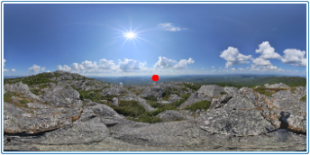

---
---

# Sun
The **Sun** is a powerful invisible parallel light. Factors simulating real-world conditions such as latitude and longitude, time of day, and season control the Sun's direction and brightness.
Solar angles are required to perform sunlight calculations. There are two ways to specify the sun direction: by date, time, and place; and by direct angle. Use date, time, and place positioning to simulate the real sun in a study of your model's site. Direct sun angle controls the light angle without reference to a real sun. Use the direct sun angle to try lighting effects.
 ** 
*Sydney, Australia, 21-June, 09:30.*
 ** 
*Stockholm, Sweden, 21-June, 09:30.*

## Set azimuth and altitude
Use solar angles to set the sun's direction. Enables **Azimuth** and **Altitude** controls.

#### Azimuth
Sets the sun's direction in angle degrees from North (0).

#### Altitude
Sets the sun's height in the sky in angle degrees from the Equator (0).

## Set location on Earth
 **Note** : **North** is the World Y direction.

### Date
Specifies the date.

### Time
Specifies the local time of day.

### Daylight savings time
Sets the time forward by one hour.

### Latitude/Longitude
Enter a latitude and longitude or pick a location on the map.
The numbers will also update to display the latitude and longitude of the a location picked on the map.

### Time zone

>Displays the time zone for the specified location.

### City list

>Select a city to set the location.

### Map
Click the map to specify a location.
 **Note** : Drag with the left mouse button to pan the map.

### Sun intensity
Modifies the brightness of the sun (direct) daylight component. The intensity of sun is automatically calculated based on solar angles and sky conditions, but can be modified, to balance with other lights.

### Sun highlight
The sharpness of the sun highlight.

*Sun highlight=0 (left) and 1 (right).*
 **Note** : Solar highlight artifacts can sometimes be seen on exterior renderings when the **Sun highlight** setting is used. To mitigate or eliminate this artifact, set the **Sun highlight** to a smaller value.

## Sky
Two kinds of built-in sky lighting are provided: [HDR image](lighting-advanced-tab.html#hdri) sky and [Automatic sky](#automatic-sky). HDR image sky uses an image with lighting values stored on each pixel to provide light and reflection. Automatic sky uses a real-world sun location and cloudiness to simulate a sky.
The lighting preset schemes for [Exterior](lighting-tab.html#exterior-daylight) and [Interior](lighting-tab.html#interior-daylight) daylight use the Automatic sky by default. The [Studio](lighting-tab.html#studio-lighting) lighting preset scheme uses HDR image lighting by default.

## High-Dynamic-Range Image Sky
A high-dynamic-range (HDR) image is a 2-D image file. These images contain a much broader range of values a standard image file, such as a .jpg or .png. This extra data can be used to light models. If the values contained in the HDR are accurate, then the lighting will be accurate.

*HDRi lighting.*
It is assumed that HDR images contain radiance values expressed in units of watts. If this is not the case, the intensity of these HDR images may need to be adjusted in order to achieve proper illumination levels.
In addition to the Sky, a different HDR image can be used for each of the three background channels: [Visible](environment-tab.html#advanced-background), [Reflected](environment-tab.html#advanced-background), and [Refracted](environment-tab.html#advanced-background) background.
The preset Studio Lighting scheme uses HDR images for the sky. If you are thinking of studio lighting as an indoor activity, think of the HDR image as a ceiling that emits light based on the colors in the image.

### Image
Specifies the HDR image file.

### Intensity
Modifies the brightness of the HDR image light.
 **Note** : This setting only matters if there are other lights in the scene that have to be compensated for. If there are no other lights, the tone operator will compensate the exposure and the rendered image will not be brighter or dimmer based on this setting.

*Low and high HDR intensity.*
In the illustration, the image has been rotated so the reflection of the sun appears on the object. Enter rotation degrees or interactively move the rotation widget indicator.

*Image rotated so the sun appears on the object.*

### Saturation
The color saturation for the light. Since the light from an HDR image is the color of the pixels in the image, this sometimes produces unwanted color effects. Set the saturation low if you want the light from the image, but not the color.

*Low (left) and high (right) saturation.*

## Automatic Sky
Automatic sky uses settings from the [Sun tab](sun-and-sky-tabs.html) to specify the location of the sun and its intensity.

*Automatic sky: sun high (left) and low (right) in the sky.*

### Cloudiness
When **Cloudiness** is turned off, strong shadows are created. The greater the cloudiness, the less contrast there will be between the light and shadows.
The **Cloudiness** setting affects many aspects of the daylight calculation, including the relative amounts of direct vs. indirect lighting, the way indirect lighting is calculated, and the background color if **Automatic Sky** mode has been selected. The **Cloudiness** setting varies from 0 (clear) to 1 (completely overcast).

*Cloudiness 0 (left) and 1 (right).*

### Sky intensity
Modifies the brightness of the sky (indirect) daylight component. The intensity of skylight is automatically calculated based on solar angles and sky conditions, but can be modified.
 **Note** : This setting only matters if there are other lights in the scene that have to be compensated for. If there are no other lights, the tone operator will compensate the exposure and the rendered image will not be brighter or dimmer based on this setting.
&#160;

